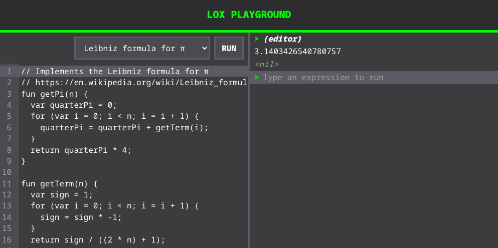

# lox-playground

A playground for running Lox, the programming language from Bob Nystrom's [Crafting Interpreters](https://craftinginterpreters.com/).

It features an editor and a REPL and runs the Lox code on the browser using [loxjs](https://github.com/chidiwilliams/loxjs).
